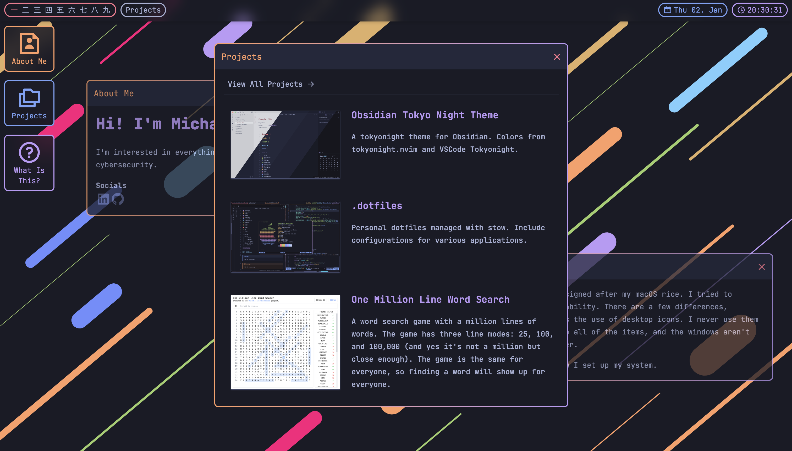

# Personal Website

Built with Svelte and Tailwind CSS. Hosted on Cloudflare Pages. Icons from https://remixicon.com/

## Why does it look like that?

It is designed after my macOS rice. I tried to replicate it to the best of my ability. There are a few differences, however. The most notable one is the use of desktop icons. I never use them :/. The bar also doesn't include all of the items, and the windows aren't snapping like in a window manager.

Check out my [dotfiles](https://github.com/tcmmichaelb139/.dotfiles) to see how I set up my system.
